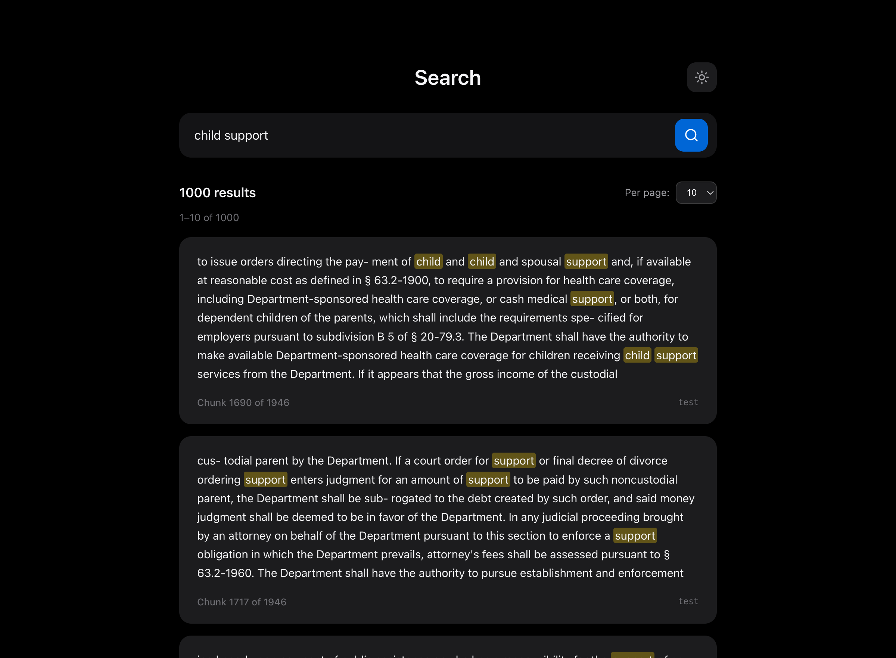
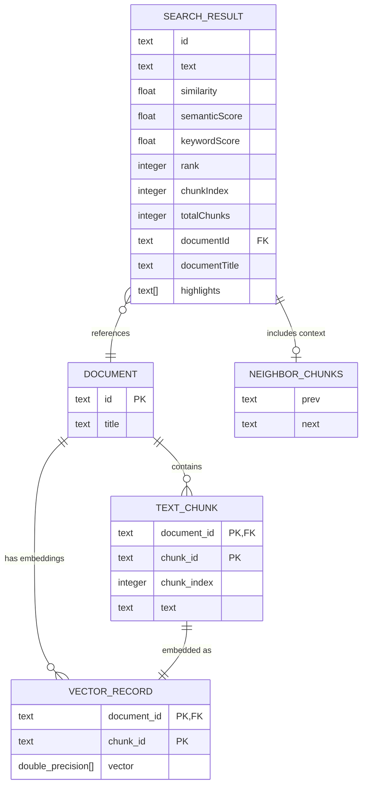

# my-wasm-search

Semantic Search application to demonstrate [wasm-similarity](https://www.npmjs.com/package/wasm-similarity) and [di-framework](https://github.com/geoffsee/di-framework)



## Quick Start

```bash
npm install
OPENAI_API_KEY=$YOUR_KEY npm run dev
open http://localhost:5173
```

## System Architecture



### Data Flow

1. **Document Ingestion**: Documents are split into `TEXT_CHUNK`s and each chunk is embedded into a `VECTOR_RECORD`
2. **Search**: Queries are processed via semantic (vector similarity), keyword (Jaccard index), or hybrid (RRF fusion) modes
3. **Results**: `SEARCH_RESULT`s reference chunks with optional neighbor context for surrounding text
